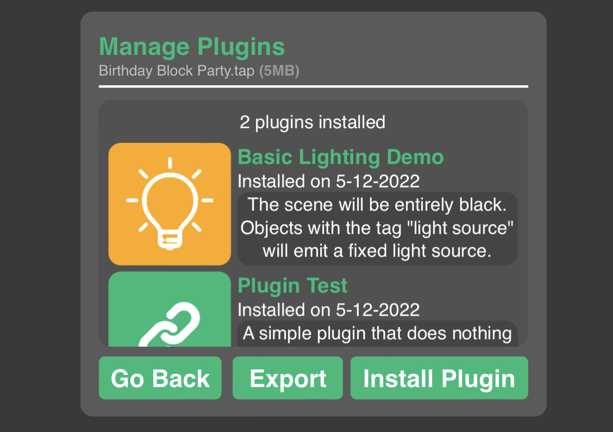

# hyperPad-Project-Modder
A web application that allows users to import **hyperPad project files** `(.tap)` and apply crazy modifications, plugins and optimizations to help improve productivity and performance. This project is maintained by the community and is *not* endorsed by hyperPad developers.

This is currently a ```beta```, so some features may not work and some may not be implemented since this project is trivial and experimental.

# Try It Out
You can test out the web application by clicking on the link provided below. Make sure you have a hyperPad project file `(.tap)` to test the app with! Please note that *.zip* files are **NOT** supported - the extension must be *.tap*!
## https://rxcodes.github.io/hyperPad-Project-Modder/

# Functional Features
## Plugins

Users can create their own <code>plugin</code> by putting all the necessary behaviors in one object and then saving it to their account to use in other projects - that means you can <b style='color:#00bb78'>clone behaviors and assets</b> from one project to another! Users can share their plugins as a file and can also have the choice of making the plugin closed source to hide behaviors!

## Modify Objects

Select mutliple objects throughout your <b>entire</b> project using a search algorithm and modify their properties such as <code>object type</code>, <code>transformation</code> and much more! For example, you can change <code>Empty</code> Objects into <code>Graphic</code> Objects which was a highly requested feature! You can also delete multiple objects at once if you are trying to clear up some memory.

## Manipulate Behaviors

You can <b>downgrade</b> behaviors so the project can work in earlier versions of hyperPad and you can <b>transfer</b> behaviors from one object to another. There is an option to <b>delete</b> behaviors in an object via the <code>Modify Objects</code> menu.

## Edit Scene Data

Modify screen position, zoom, scene type <i>(that means you can change an overlay to a level and vice versa!)</i> and many other properties of a specified scene.

## View Project Data

<b>See how many objects, behaviors and assets are present in the entire project.</b> For example, you can see how many of each behavior you've used! Don't worry about counting behaviors or keeping track of how many objects are in your scene - this app does that for you!

# Planned Features
## Assets Management
- **Compress all assets** to shrink overall project size - there will be compression options.
- See file sizes of all assets - user can decide to delete assets that take more storage.

# Version History
View the earlier versions of hyperPad Project Modder.

## Beta Stage
- v0.1: https://rxcodes.github.io/hyperPad-Project-Modder/versions/v0.1.html
- v0.2: https://rxcodes.github.io/hyperPad-Project-Modder/versions/v0.2.html
- v0.3: https://rxcodes.github.io/hyperPad-Project-Modder/versions/v0.3.html
- v0.4: https://rxcodes.github.io/hyperPad-Project-Modder/versions/v0.4.html
- v0.5: https://rxcodes.github.io/hyperPad-Project-Modder/versions/v0.5.html
- v0.6: https://rxcodes.github.io/hyperPad-Project-Modder/versions/v0.6.html
- v0.7: https://rxcodes.github.io/hyperPad-Project-Modder/versions/v0.7.html
- v0.8: https://rxcodes.github.io/hyperPad-Project-Modder/versions/v0.8.html
- v0.9: https://rxcodes.github.io/hyperPad-Project-Modder/versions/v0.9.html
- v0.10: https://rxcodes.github.io/hyperPad-Project-Modder/versions/v0.10.html
- v0.11: https://rxcodes.github.io/hyperPad-Project-Modder/versions/v0.11.html
- v0.12 **(Current)**: https://rxcodes.github.io/hyperPad-Project-Modder/

## Alpha Stage
`Coming soon...?`
