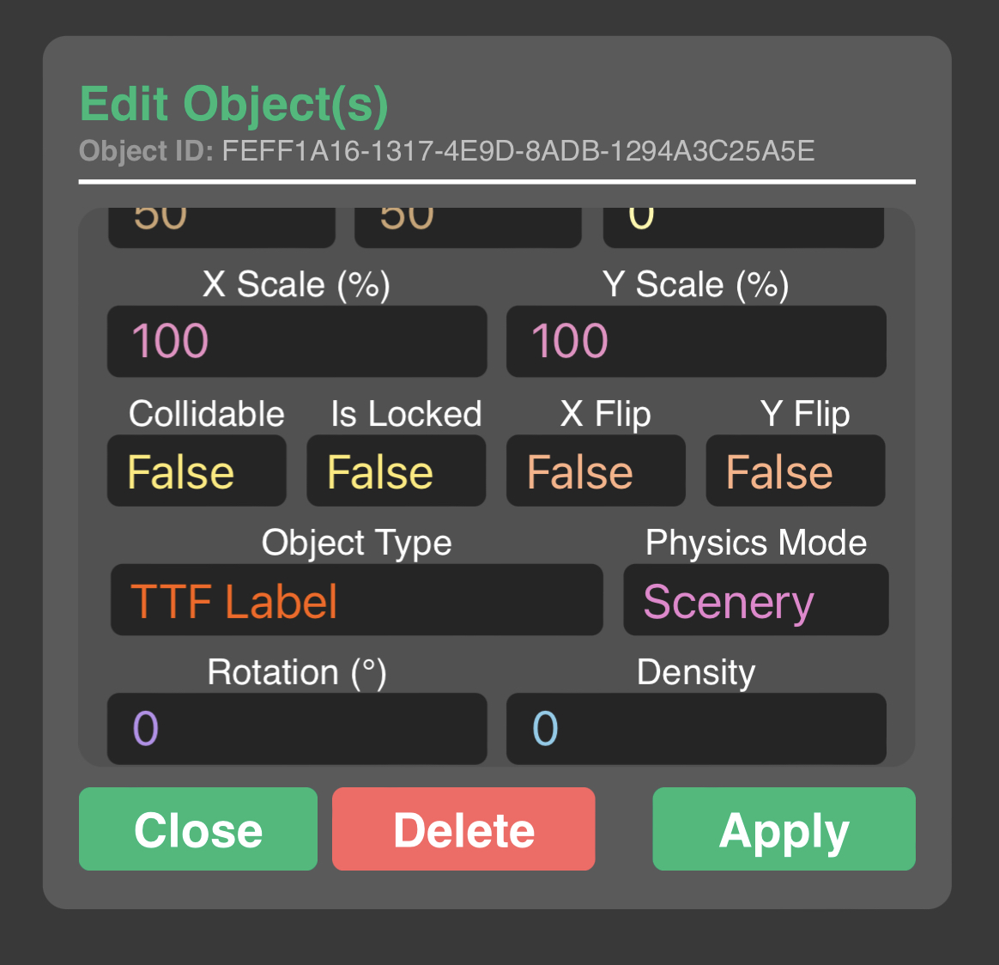
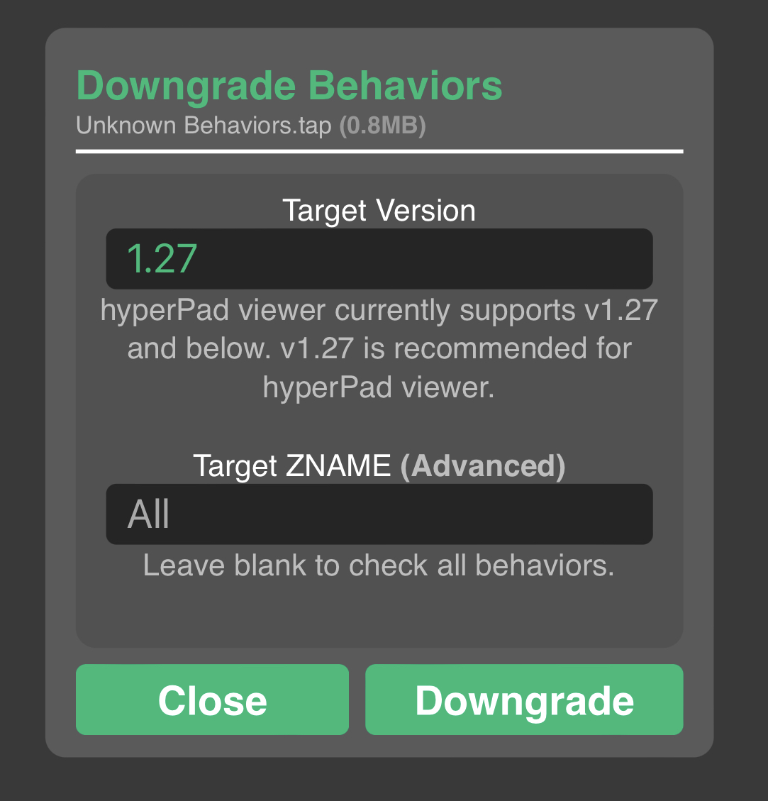
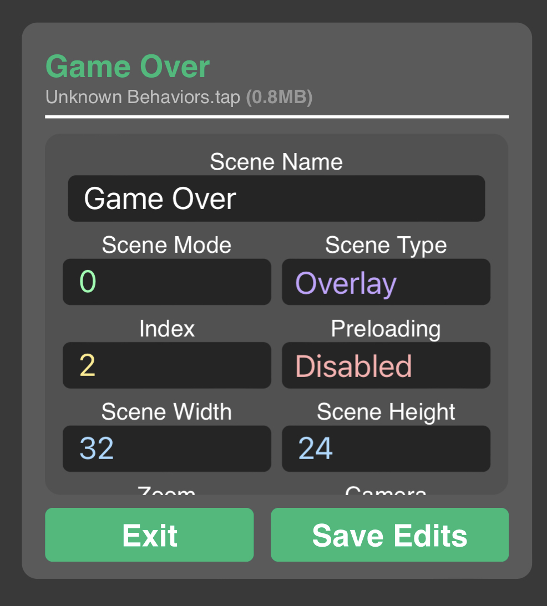
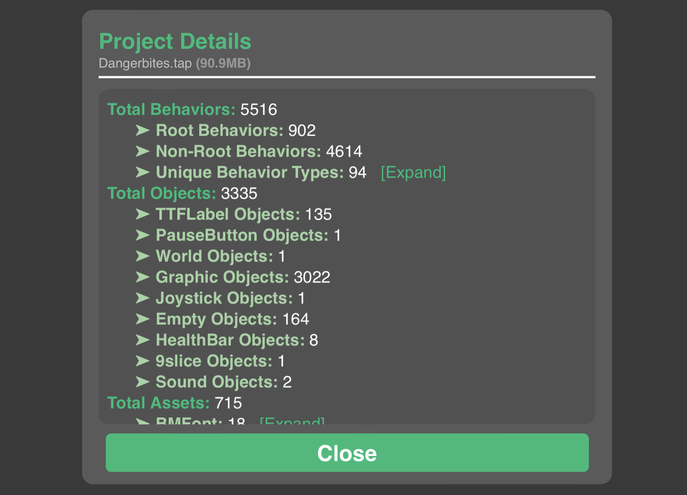

# hyperPad-Project-Modder
A web application that allows users to import **hyperPad project files** `(.tap)` and apply crazy modifications, plugins and optimizations to help improve productivity and performance. This project is maintained by the community and is *not* endorsed by hyperPad developers.

This is currently a ```beta```, so some features may not work and some may not be implemented since this project is trivial and experimental.

# Try It Out
You can test out the web application by clicking on the link provided below. Make sure you have a hyperPad project file `(.tap)` to test the app with! Please note that *.zip* files are **NOT** supported - the extension must be *.tap*!
## https://rxcodes.github.io/hyperPad-Project-Modder/

# Functional Features
## Modify Objects

Select mutliple objects throughout your <b>entire</b> project using a search algorithm and modify their properties such as <code>object type</code>, <code>transformation</code> and much more! For example, you can change <code>Empty</code> Objects into <code>Graphic</code> Objects which was a highly requested feature! You can also delete multiple objects at once if you are trying to clear up some memory.

## Downgrade Behaviors

Provide a target version and this app will try to <b>downgrade all behaviors to the desired version</b> - this can be useful if you are trying to make newer projects work in older versions of hyperPad, especially for <code>hyperPad viewer</code>. Please note that for behaviors that don't exist on the viewer app, these behaviors will not function and execute at all.

## Edit Scene Data

Modify screen position, zoom, scene type <i>(that means you can change an overlay to a level and vice versa!)</i> and many other properties of a specified scene.

## View Project Data

<b>See how many objects, behaviors and assets are present in the entire project.</b> For example, you can see how many of each behavior you've used! Don't worry about counting behaviors or keeping track of how many objects are in your scene - this app does that for you!

# Planned Features
## Plugins
- **Add / remove plugins from a project** - A plugin is a mirrored object with behaviors that work together to perform advanced functionality in a project. The best part of these plugins is that it can imported into multiple projects with ease and work the same across all of them.
- **Create your own plugin** - users can create their own plugin by putting all the necessary behaviors in one object and then saving it to their account to use in other projects. They have the choice of making the plugin public and sharing it with others.

## Behaviors Management
- **Transfer behaviors from one object to another** - even if the objects are in different scenes and layers.
- Perform batch actions such as transferring behaviors from one object to another or restricting edit access to behaviors in certain objects.

## Assets Management
- **Compress all assets** to shrink overall project size - there will be compression options.
- See file sizes of all assets - user can decide to delete assets that take more storage.
- Multi-select assets and perform actions on all of them at once.
